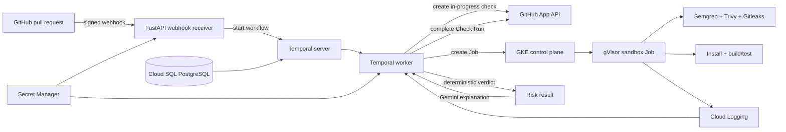

# SecurePR

SecurePR is a pull-request verification platform for running untrusted GitHub code in isolated Kubernetes sandboxes. It receives GitHub App webhooks, orchestrates each verification with Temporal, scans the checked-out revision for security issues, installs dependencies and runs tests, then publishes a deterministic verdict and a short explanation back to the pull request as a GitHub Check Run.

The current implementation targets Python and Node.js repositories and is designed for Google Cloud, Google Kubernetes Engine (GKE), Artifact Registry, Secret Manager, Cloud Logging, Cloud SQL, and Vertex AI.

> [!IMPORTANT]
> SecurePR executes code submitted through pull requests. Deploy it only in a dedicated, hardened environment. Review the [security model](#security-model), IAM permissions, network policies, image provenance, and the [known limitations](#known-limitations) before using it with untrusted contributors.

## Contents

- [What it does](#what-it-does)
- [Architecture](#architecture)
- [Deterministic verdicts](#deterministic-verdicts)
- [Supported projects and execution priority](#supported-projects-and-execution-priority)
- [Security model](#security-model)
- [Repository layout](#repository-layout)
- [Configuration](#configuration)
- [Prerequisites](#prerequisites)
- [Deployment](#deployment)
- [Local development](#local-development)
- [Validation and operations](#validation-and-operations)
- [Troubleshooting](#troubleshooting)
- [Known limitations](#known-limitations)
- [Contributing](#contributing)

## What it does

- Verifies GitHub webhook signatures before accepting an event.
- Responds to pull requests that are opened, updated, reopened, or marked ready for review.
- Uses Temporal to make the verification process durable and observable.
- Creates an isolated Kubernetes Job for each pull-request revision.
- Runs sandbox pods with the `gvisor` runtime class.
- Restricts inbound traffic and allows outbound HTTPS only to approved package and source hosts.
- Enforces sandbox runtime and image-source policies with Kyverno.
- Scans source and dependencies with Semgrep, Trivy, and Gitleaks.
- Detects common Python and Node.js build/test conventions.
- Uses Vertex AI only when deterministic project detection cannot produce an execution plan.
- Calculates pass, neutral, or failure outcomes with fixed rules—not an LLM.
- Publishes the outcome, summary, and an execution-log excerpt as a GitHub Check Run.

## Architecture



### Verification lifecycle

1. GitHub sends a `pull_request` webhook to `POST /webhook`.
2. The receiver validates `X-Hub-Signature-256` with the configured webhook secret.
3. Relevant actions start a Temporal workflow with a revision-specific workflow ID.
4. The worker creates an in-progress GitHub Check Run.
5. The worker inspects the repository root. Recognized marker files use deterministic execution; otherwise Gemini may suggest a constrained `pip` or `npm` plan.
6. The worker creates a one-shot Kubernetes Job using the configured sandbox image and `runtimeClassName: gvisor`.
7. The sandbox clones the repository and checks out the exact pull-request head SHA.
8. Semgrep, Trivy, and Gitleaks run before the project build/tests.
9. The sandbox emits a single `FINDINGS_JSON:` log record containing machine-readable scan counts.
10. The worker reads the pod logs from Cloud Logging and calculates the verdict using fixed rules.
11. Gemini turns the already-decided result and relevant log excerpt into a short developer-facing explanation.
12. The worker completes the GitHub Check Run with the verdict, summary, and logs.

## Deterministic verdicts

Gemini does not choose whether a pull request passes. `assess_risk_activity` applies the following rules in order:

| Condition | GitHub conclusion |
| --- | --- |
| Build or tests fail | `failure` |
| Gitleaks finds one or more potential secrets | `failure` |
| Trivy finds one or more critical vulnerabilities | `failure` |
| Trivy finds one or more high vulnerabilities, with no failure condition above | `neutral` |
| None of the above | `success` |

Semgrep findings and lower-severity Trivy findings are reported, but they do not currently change the conclusion.

## Supported projects and execution priority

The sandbox chooses the first matching strategy:

1. **`securepr.sh`** — runs `bash securepr.sh` from the repository root.
2. **Node.js** — if `package.json` exists, runs `npm install`, followed by `npm test` when a test script is defined.
3. **Python** — if `requirements.txt` or `pyproject.toml` exists, installs the project and runs `pytest` when tests are detected.
4. **AI-proposed plan** — when no deterministic marker exists, the worker may ask Gemini for one install command and one test command restricted to `npm` or `pip` projects.
5. **Clone-only fallback** — if no strategy is found, SecurePR lists the repository contents and reports that nothing was run.

For Python projects, the runner also makes best-effort attempts to install optional/dependency groups named `test`, `tests`, `testing`, and `dev`. Failures from those optional attempts are ignored; failure of the main dependency installation is not.

### Custom execution with `securepr.sh`

A repository can take explicit control of its verification command by placing an executable-compatible shell script at its root:

```bash
#!/usr/bin/env bash
set -euo pipefail

python -m pip install --break-system-packages -r requirements.txt
python -m pytest
```

The script still runs inside the same sandbox, runtime, and network restrictions. Only tools included in the sandbox image and destinations allowed by the network policies are available.

## Security model

SecurePR uses several independent controls because no single sandbox boundary should be treated as sufficient for hostile code.

| Layer | Control |
| --- | --- |
| GitHub ingress | HMAC-SHA256 webhook signature verification |
| Workflow identity | Revision-specific workflow and exact head-SHA checkout |
| Container runtime | GKE Sandbox through `runtimeClassName: gvisor` |
| Admission control | Kyverno requires gVisor and restricts the sandbox image registry |
| Network | No inbound connections; DNS plus allowlisted HTTPS destinations only |
| Process isolation | Linux user, mount, UTS, IPC, and PID namespaces |
| Privileges | Linux capability bounding, effective, permitted, and inheritable sets are dropped |
| Syscalls | `pyseccomp` allowlist; unlisted syscalls return `EPERM` |
| Credentials | GitHub App key and webhook secret are loaded from Google Secret Manager |
| Kubernetes API | Worker Role permits only Job creation/status and pod/log reads |
| Decision integrity | Verdict rules are deterministic and separate from AI-generated prose |

Runtime egress is currently limited to:

- `github.com`
- `registry.npmjs.org`
- `pypi.org`
- `files.pythonhosted.org`

The Semgrep rules, Trivy binary/database, and Gitleaks binary are baked into the sandbox image so the scanners do not need unrestricted runtime downloads.

## Repository layout

| Path | Purpose |
| --- | --- |
| `webhook_receiver.py` | FastAPI webhook endpoint, signature validation, and Temporal workflow startup |
| `github_client.py` | Google Secret Manager access and GitHub App installation authentication |
| `pr_workflow.py` | Temporal workflow, Kubernetes Job construction, log collection, verdict calculation, and Check Run updates |
| `temporal_worker.py` | Registers and runs the workflow and its activities |
| `run_pr.py` | Clones the PR revision, runs scanners, detects the project, and executes its tests |
| `ns_sandbox_v4.py` | Inner Linux namespace, capability, and seccomp sandbox launcher |
| `build_semgrep_rules.py` | Builds the offline Python/JavaScript/TypeScript Semgrep ruleset |
| `Dockerfile` | Sandbox runner image |
| `Dockerfile.worker` | Temporal worker image |
| `Dockerfile.webhook` | Webhook receiver image |
| `k8s/temporal-server.yaml` | Temporal server, Cloud SQL proxy sidecar, and service |
| `k8s/temporal-worker.yaml` | Temporal worker deployment |
| `k8s/webhook-receiver.yaml` | Webhook deployment and public load balancer |
| `k8s/worker-rbac.yaml` | Minimal namespace-scoped permissions for the worker |
| `k8s/network-policy.yaml` | Default deny plus GKE NodeLocal DNS access for sandbox pods |
| `k8s/sandbox-fqdn-policy.yaml` | GKE FQDN egress allowlist |
| `k8s/kyverno-*.yaml` | Admission policies and negative test manifests |
| `trigger_pr_workflow.py` | Manually starts a workflow for a hard-coded test pull request |

## Configuration

Several deployment identifiers are currently constants in the source. Update them before deploying into a different environment.

| Setting | Current location | Default/current value |
| --- | --- | --- |
| Google Cloud project | `github_client.py`, `pr_workflow.py` | `securepr-505401` |
| Google Cloud region | `pr_workflow.py` | `us-central1` |
| Gemini model | `pr_workflow.py` | `gemini-2.5-pro` |
| GitHub App ID | `github_client.py` | `4562657` |
| Sandbox image | `pr_workflow.py` | Artifact Registry `pr-sandbox:v9` |
| Kubernetes namespace | `pr_workflow.py` | `default` |
| Temporal task queue | `pr_workflow.py` | `securepr-task-queue` |
| Temporal address | `temporal_worker.py`, `webhook_receiver.py` | `localhost:7233` or `TEMPORAL_ADDRESS` |
| GitHub private-key secret | `github_client.py` | `github-app-private-key` |
| Webhook secret | `webhook_receiver.py` | `webhook-secret` |

The Kubernetes manifests additionally assume:

- Artifact Registry repository `pr-sandbox-repo` in `us-central1`.
- Cloud SQL instance `securepr-505401:us-central1:temporal-db`.
- Kubernetes service accounts named `temporal-server-ksa`, `temporal-worker-ksa`, and `webhook-ksa`.
- Kubernetes Secret `temporal-db-credentials` with a `password` key.
- GKE NodeLocal DNSCache at `169.254.20.10`.

## Prerequisites

For a production-style deployment, you need:

- A Google Cloud project with billing enabled.
- A GKE cluster with the gVisor `RuntimeClass` available.
- GKE Dataplane V2/FQDN network-policy support for `FQDNNetworkPolicy`.
- Kyverno installed in the cluster.
- An Artifact Registry Docker repository.
- A PostgreSQL database reachable through the Cloud SQL Auth Proxy.
- Temporal persistence schema/database configuration compatible with the `temporalio/auto-setup` image.
- A GitHub App installed on the repositories to be checked.
- Access to Vertex AI Gemini, Secret Manager, Cloud Logging, Artifact Registry, GKE, and Cloud SQL.
- Docker, `gcloud`, and `kubectl` on the deployment workstation.
- Workload Identity or equivalent Google credentials for each component.

### GitHub App permissions

Configure the GitHub App with at least the permissions required by the code:

- **Checks:** read and write
- **Contents:** read
- **Metadata:** read
- **Pull requests:** read

Subscribe the app to **Pull request** events. Set the webhook URL to:

```text
https://<webhook-host>/webhook
```

Use the same random webhook secret in the GitHub App configuration and the Google Secret Manager `webhook-secret` secret.

## Deployment

The repository contains application and policy manifests, but it does not provision the GCP project, cluster, database, Artifact Registry repository, IAM bindings, service accounts, or GitHub App. Create those resources first.

The examples below assume the existing project and region. Change them together with the constants and manifests when deploying elsewhere.

### 1. Authenticate Docker and select the cluster

```bash
gcloud config set project securepr-505401
gcloud auth configure-docker us-central1-docker.pkg.dev
gcloud container clusters get-credentials <cluster-name> --region us-central1
```

### 2. Store GitHub secrets

Create secrets if they do not exist:

```bash
gcloud secrets create github-app-private-key --replication-policy=automatic
gcloud secrets create webhook-secret --replication-policy=automatic
```

Add secret values without committing them to the repository:

```bash
gcloud secrets versions add github-app-private-key --data-file=/path/to/github-app-private-key.pem
printf '%s' '<your-webhook-secret>' | gcloud secrets versions add webhook-secret --data-file=-
```

Grant the webhook and worker Google service accounts access only to the secrets they use. The worker also needs Cloud Logging read access and Vertex AI access.

### 3. Create Kubernetes identities and the database secret

```bash
kubectl create serviceaccount temporal-server-ksa
kubectl create serviceaccount temporal-worker-ksa
kubectl create serviceaccount webhook-ksa

kubectl create secret generic temporal-db-credentials \
  --from-literal=password='<temporal-database-password>'
```

Bind these Kubernetes service accounts to appropriately scoped Google service accounts using Workload Identity. The Temporal server identity needs Cloud SQL connectivity; the worker needs Secret Manager, Cloud Logging, Vertex AI, and cluster access; the webhook needs Secret Manager.

### 4. Build and push the images

```bash
REGISTRY=us-central1-docker.pkg.dev/securepr-505401/pr-sandbox-repo

docker build -t "$REGISTRY/pr-sandbox:v9" .
docker build -f Dockerfile.worker -t "$REGISTRY/temporal-worker:v1" .
docker build -f Dockerfile.webhook -t "$REGISTRY/webhook-receiver:v1" .

docker push "$REGISTRY/pr-sandbox:v9"
docker push "$REGISTRY/temporal-worker:v1"
docker push "$REGISTRY/webhook-receiver:v1"
```

Keep the image tags in `pr_workflow.py`, the deployments, and the Kyverno image policy consistent. Prefer immutable version tags or digests for production releases.

### 5. Apply access and security policies

```bash
kubectl apply -f k8s/worker-rbac.yaml
kubectl apply -f k8s/kyverno-require-gvisor.yaml
kubectl apply -f k8s/kyverno-restrict-image.yaml
kubectl apply -f k8s/network-policy.yaml
kubectl apply -f k8s/sandbox-fqdn-policy.yaml
```

Confirm the cluster recognizes the required runtime and policy resources:

```bash
kubectl get runtimeclass gvisor
kubectl get clusterpolicy
kubectl get networkpolicy
kubectl get fqdnnetworkpolicy
```

### 6. Deploy Temporal, the worker, and the webhook

```bash
kubectl apply -f k8s/temporal-server.yaml
kubectl rollout status deployment/temporal-server

kubectl apply -f k8s/temporal-worker.yaml
kubectl apply -f k8s/webhook-receiver.yaml

kubectl rollout status deployment/temporal-worker
kubectl rollout status deployment/webhook-receiver
```

Get the webhook endpoint after the load balancer is provisioned:

```bash
kubectl get service webhook-receiver
```

Configure the resulting public URL in the GitHub App, appending `/webhook`.

## Local development

The components can run locally against an accessible Temporal server, but most workflows still require Google credentials, Secret Manager values, Kubernetes access, Cloud Logging, Vertex AI, and a GitHub App installation.

Create a virtual environment and install the combined application dependencies:

```bash
python -m venv .venv
source .venv/bin/activate
python -m pip install \
  fastapi uvicorn temporalio kubernetes-asyncio PyGithub \
  google-cloud-secret-manager google-cloud-logging google-genai
```

On PowerShell, activate the environment with:

```powershell
.\.venv\Scripts\Activate.ps1
```

Authenticate Application Default Credentials and select the project:

```bash
gcloud auth application-default login
gcloud config set project securepr-505401
```

Point the worker and webhook at Temporal, then start them in separate terminals:

```bash
export TEMPORAL_ADDRESS=localhost:7233
python temporal_worker.py
```

```bash
export TEMPORAL_ADDRESS=localhost:7233
uvicorn webhook_receiver:app --reload --port 8000
```

The webhook receiver reads `webhook-secret` during module import, so valid Google credentials and Secret Manager access are required before starting Uvicorn.

### Manual workflow trigger

`trigger_pr_workflow.py` contains a hard-coded example `PRTarget`. Update the repository, clone URL, pull-request number, head SHA, refs, and installation ID before running it:

```bash
python trigger_pr_workflow.py
```

This bypasses webhook delivery but still exercises the Temporal worker, GitHub App, Kubernetes Job, Cloud Logging, Vertex AI, and Check Run integration.

## Validation and operations

### Health and rollout checks

```bash
curl http://<webhook-host>/healthz
kubectl get deployments,pods,jobs
kubectl logs deployment/webhook-receiver
kubectl logs deployment/temporal-worker
kubectl logs deployment/temporal-server -c temporal
```

Sandbox jobs use the `app=pr-sandbox` label:

```bash
kubectl get pods -l app=pr-sandbox
kubectl describe pod -l app=pr-sandbox
```

The workflow itself reads sandbox output from Cloud Logging. If a Job completes but the Check Run lacks findings, confirm that container logs are reaching Cloud Logging and that the worker identity can list entries. The worker polls for the `FINDINGS_JSON:` marker for up to approximately 45 seconds.

### Admission-policy negative tests

The two Kyverno test manifests are intentionally invalid and should be rejected by the admission controller:

```bash
kubectl apply -f k8s/kyverno-test-bad-runtimeclass.yaml
kubectl apply -f k8s/kyverno-test-bad-image.yaml
```

The first omits gVisor; the second uses an image outside the approved Artifact Registry path. Admission is expected to fail.

### Basic source validation

There is not yet a complete automated test suite for this repository. At minimum, compile the Python modules and validate Kubernetes YAML with your cluster or preferred schema tool:

```bash
python -m py_compile \
  github_client.py webhook_receiver.py pr_workflow.py temporal_worker.py \
  run_pr.py ns_sandbox_v4.py build_semgrep_rules.py

kubectl apply --dry-run=server -f k8s/
```

## Troubleshooting

### Webhook returns `401 Invalid signature`

- Confirm the GitHub App and Secret Manager contain the exact same webhook secret.
- Verify that GitHub is calling `/webhook`, not `/`.
- Do not transform or re-encode the request body in a proxy before signature verification.

### Webhook starts but cannot connect to Temporal

- Check `TEMPORAL_ADDRESS`; Kubernetes deployments use `temporal-server:7233`.
- Confirm the Temporal Service and pods are ready.
- Inspect both the Temporal server container and Cloud SQL proxy sidecar logs.

### Sandbox Job is rejected

- Confirm `runtimeClassName: gvisor` exists in the cluster.
- Confirm the image path matches the Kyverno registry policy.
- Inspect admission events with `kubectl describe` and Kyverno logs.

### Dependency installation cannot reach a registry

- Confirm both the standard `NetworkPolicy` and GKE `FQDNNetworkPolicy` are installed.
- Verify NodeLocal DNSCache uses `169.254.20.10`; update `network-policy.yaml` if the cluster uses a different resolver.
- Add genuinely required package hosts deliberately. Avoid broad internet egress.

### Workflow finishes but logs or findings are missing

- Verify GKE workload logs are enabled and delivered to Cloud Logging.
- Grant the worker permission to read log entries in the configured project.
- Confirm the sandbox prints an unbuffered, single-line `FINDINGS_JSON:` record.

### GitHub Check Run cannot be created or updated

- Confirm the GitHub App is installed on the target repository.
- Confirm the webhook payload contains an installation ID.
- Verify the App has read/write Checks permission and read access to repository contents.
- Confirm the private key stored in Secret Manager belongs to the configured App ID.

## Known limitations

- Python and Node.js are the only intentionally supported project ecosystems.
- The project currently hard-codes GCP, GitHub App, namespace, model, and image identifiers instead of using a centralized configuration layer.
- The Trivy vulnerability database is captured when the sandbox image is built and becomes stale until the image is rebuilt.
- Semgrep findings are informational for verdict purposes; any count can still produce `success` if no higher-priority rule triggers.
- A scanner execution or JSON-parsing failure is currently reported in the logs but does not automatically fail the Check Run.
- Optional Python dependency-group installation is best-effort and silently ignores unavailable group names.
- The AI fallback executes generated shell commands. The commands are constrained by the prompt and sandbox boundaries, but they are not parsed against a command allowlist.
- `trigger_pr_workflow.py` contains environment-specific sample values and must be edited before use.
- `trigger_test_workflow.py` is a legacy smoke script that references a removed `GreetingWorkflow` and is not part of the current PR-verification path.
- `k8s/sandbox-job.yaml` and the `*-test-*.yaml` files are development/test manifests, not the production Job created by `pr_workflow.py`.
- The repository does not yet include infrastructure-as-code, dependency lock files, CI configuration, database provisioning, or a comprehensive automated test suite.
- `Dockerfile.webhook` imports `pr_workflow.py`, which depends on `google-genai`, but the image currently does not install that package. Add `google-genai` to the webhook image dependencies before deploying it.

## Contributing

When changing the sandbox or policy layers:

1. Keep verdict calculation deterministic and auditable.
2. Treat additions to the syscall list, network allowlist, IAM roles, and Kubernetes RBAC as security-sensitive changes.
3. Rebuild and version the sandbox image when scanners, scanner databases, rules, or runtime dependencies change.
4. Update all matching image references and this README when deployment identifiers change.
5. Validate both positive workloads and the negative Kyverno policy tests.

## License

SecurePR is available under the [MIT License](LICENSE).
